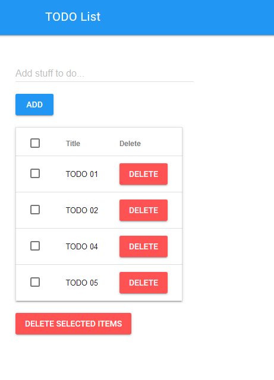

# todo-demo-spread
Prototype of a todo list in PHP using twig

Screenshot:

## Installation
Copy [db_config.inc.php.default](db_config.inc.php.default) to db_config.inc.php
and set the values according to your environment.
Then run [createDB.sql](createDB.sql) to create the database and the table.

